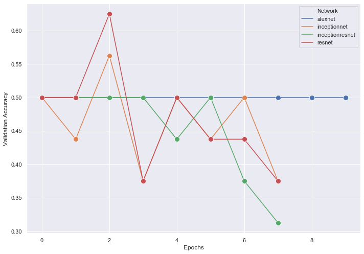
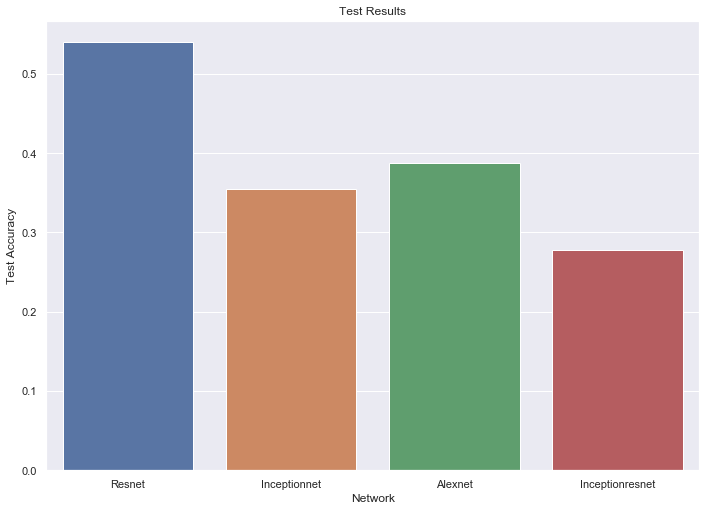

# X-Ray-Pneumonia-Identification
To find the ideal base network architecture (no image preprocessing), I compared the performance between 4 common image classification networks: Alexnet, Resnet, Inceptionnet and InceptionRenset.

To compare the performance, I used the [X-ray Dastet on Kaggle](https://www.kaggle.com/datasets/paultimothymooney/chest-xray-pneumonia) made by PAUL MOONEY.

I built a DataGenerator which extracts the images and resizes them to a ```(1200, 1200)``` image and asssigned ground truth labels with 1 being true and 0 being false formatte to [Normal Lungs, Viral Infected Lungs, Bacterial Infected Lungs].

I then trained with the following hyperparemeters:
1. Learning Rate: 1e-3
2. Optimizer: Adam
3. Loss: CategoricalCrossentropy

I used the following callbacks:
1. ReduceOnPlateau
2. EarlyStopping
3. ModelChecpoint

I trained the networks until a pleateau and recorded the data. Then, I used the trained model to predict on the test data, noting its accuracy.

# Results
After training till a plateau, these were the results for each network (Validation Accuracy Against Epoxh)
<p align ="center">
  
</p>

Post Training, the were teseted on the test data data where each model performed as such:

<p align ="center">
  
</p>

# Conlusion

As the resnet has a peak validation accurcy while training and performs the best predicting the test data, it is ideal to use with Pneumonia Identification
